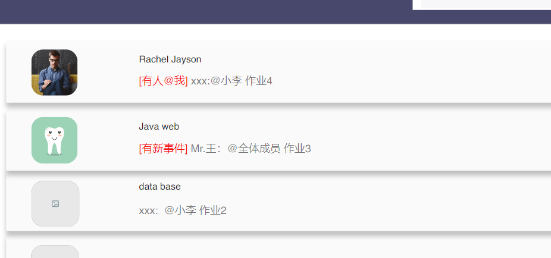
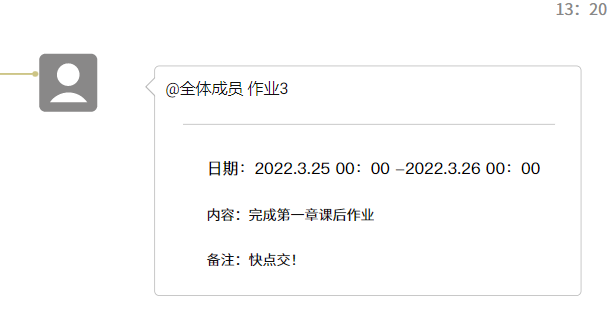
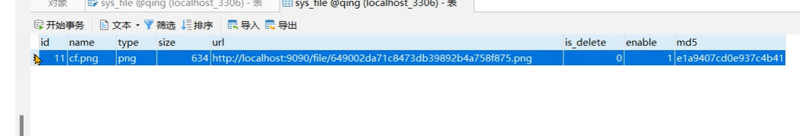
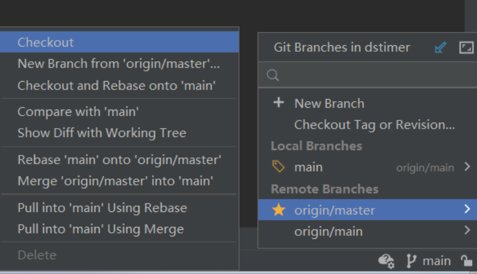

# 孙博

消息建个张表 记得导出.sql方便其他同学导入自己的数据库

用户的操作： 用户增删改查+用户登录、注销、判断登录、忘记密码....更改密码..... 

难点：登录态、Token、jwt返回JSON......

# 段瑞涛 

消息和代办增删改查和删除+分页查询  

消息和代办各建个张表 记得导出.sql方便其他同学导入自己的数据库

难点：代办就是普通记录，但是消息要实现表中表 一个通知消息里是可以有很多条小消息的 
参考：https://blog.csdn.net/One_L_Star/article/details/105520924

这种作业一个通知里可以有很多条 相当于评论的楼中楼

# 汤昱力 

上传头像  存头像的URL 

https://modao.cc/app/yBrsQNa2r9cpotmHVsXPQy#screen=sl18ul80fis5c9s

参考资料

https://www.bilibili.com/video/BV1U44y1W77D?p=17

难点：判断重复文件 用Hash一类的判重

我没理解错的话新建一个表，记得导出.sql

# 附录

## 1. 包不要乱放

按照 controller,service,dao,mapper,entity.....的结构写 

可以只用一两个层 但是最好把文件都新建到包里 比如User.java放到entity(实体)包里 UserController放到controller里 UserMapper放到mapper包里等等 不要乱放

其实都可以百度到 

## 2. 尽快把接口给前端

假如我开发用户注册 其中一个接口是 

//////////////////////////////////////////////////

方法: POST  URL：Localhost:9090/user/regester 

需要传入JSON

{

​	"name" : "猪八戒",

​	"age": 800

​	"address":"高老庄"

}

返回JSON

{

​	"status":"success"

​	"msg":"注册成功"

}

///////////////////////////////////////////////////

详情请百度springboot返回JSON，有详解。

先形成这种格式的文档发给前端，具体结构参考自己的数据库建的表，数据库表参考[原型](https://modao.cc/app/yBrsQNa2r9cpotmHVsXPQy#screen=sl18ul80fis5c9s)

参考：

接口约定 https://juejin.cn/post/6844904195624026126

## 3. git使用

直接下压缩包也行，直接git我的仓库也行

https://blog.csdn.net/qq_32224047/article/details/107068744

仓库地址 https://github.com/niliumnm/dstimer.git

下下来是没有代码的 切换一下分支 点击右下角的main 切换成master ，check out就有了

push之前先pull一下防止报错

jdk 1.8 8u211 https://pan.baidu.com/share/init?surl=gh6MpEhXRhWtpNe-_x63uQ#h263

依赖让maven去下就行
https://developer.aliyun.com/mvn/guide?spm=a2c6h.13651104.0.0.435836a4s1LJUl  阿里云maven镜像站

## 4. 难点是拿来吹牛的点

比如问你文件上传怎么弄的，你说我这个啊，service层查记录、利用Hash判重balabala的 

