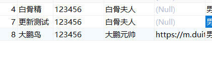
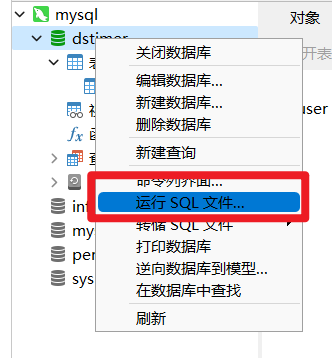
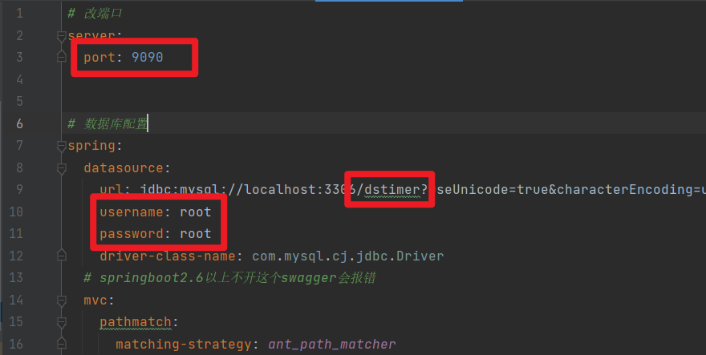

# 用户接口

## 查询全部用户 

方法：GET 

URL：http://localhost:9090/user

传入：无

返回格式：JSON例子如下

```json
[
    {
        "id": 1,
        "name": "孙悟空",
        "nickname": "齐天大圣",
        "password": "123456",
        "avatar_url": null,
        "sex": "男",
        "email": "888888@qq.com",
        "created_at": "2022-05-31 11:16:07",
        "updated_at": null,
        "phone": "188888888"
    },
    {
        "id": 2,
        "name": "猪八戒",
        "nickname": "净坛使者",
        "password": "88888",
        "avatar_url": null,
        "sex": "男",
        "email": "123456@qq.com",
        "created_at": "2022-05-31 11:18:36",
        "updated_at": null,
        "phone": "1788888888"
    },
    {
        "id": 3,
        "name": "唐僧",
        "nickname": "金蝉子",
        "password": "123456",
        "avatar_url": null,
        "sex": "男",
        "email": "8999999@163.com",
        "created_at": "2022-05-31 11:19:29",
        "updated_at": null,
        "phone": "17899999999"
    },
    {
        "id": 4,
        "name": "白骨精",
        "nickname": "白骨夫人",
        "password": "123456",
        "avatar_url": null,
        "sex": "男",
        "email": "89999999@qq.com",
        "created_at": "2022-05-31 11:20:08",
        "updated_at": null,
        "phone": "+867894561"
    }
]
```

## 插入用户/更新用户

方法：POST

URL：http://localhost:9090/user/save

**用法1 传入其他参数，但是不带id**

实例：

传入：

```JSON
{
        "name": "新插入对象",
        "nickname": "大鹏元帅",
        "password": "123456",
        "avatar_url": "https://m.duitang.com/blog/?id=1391351457&belong_album=109495738",
        "sex": "男",
        "email": "89999999@qq.com",
        "phone": "+867894561",
        "address": "天界"
}
```

返回格式

```
1
```

表示插入成功

**用法2 连ID一起传 表示更新已有的某条记录** 

```json
{
        "id":"8",
        "name": "大鹏鸟",
        "nickname": "大鹏元帅",
        "password": "123456",
        "avatar_url": "https://m.duitang.com/blog/?id=1391351457&belong_album=109495738",
        "sex": "男",
        "email": "89999999@qq.com",
        "phone": "+867894561",
        "address": "天界"
}
```

id为8的元素信息被更新



## 登录 （简陋）

方法：POST

URL：http://localhost:9090/user/login

参数 JSON

```json
{
    "name":"白骨精",
    "password":"123456"
}
```

返回这个用户的全部信息

```json
{
    "id": 4,
    "name": "白骨精",
    "nickname": "白骨夫人",
    "password": "123456",
    "avatar_url": null,
    "sex": "男",
    "email": "89999999@qq.com",
    "created_at": "2022-05-31 11:20:08",
    "updated_at": null,
    "phone": "+867894561",
    "address": null
}
```


## 删除用户

方法：DELETE

URL：http://localhost:9090/user/{id}

例：删除id为7的用户

发送DELETE http://localhost:9090/user/7

用户即被删除 返回true


## 分页查询用户

方法：GET

`http://localhost:9090/user/page?pageNum=页码&pageSize=条数`


**用法1 不传名字 结果是某一页的信息**

`http://localhost:9090/user/page?pageNum=2&pageSize=2`

返回格式

```json
{
    "records": [
        {
            "id": 3,
            "name": "唐僧",
            "nickname": "金蝉子",
            "password": "123456",
            "avatar_url": null,
            "sex": "男",
            "email": "8999999@163.com",
            "created_at": null,
            "updated_at": null,
            "phone": "17899999999",
            "address": null
        },
        {
            "id": 4,
            "name": "白骨精",
            "nickname": "白骨夫人",
            "password": "123456",
            "avatar_url": null,
            "sex": "男",
            "email": "89999999@qq.com",
            "created_at": null,
            "updated_at": null,
            "phone": "+867894561",
            "address": null
        }
    ],
    "total": 5,
    "size": 2,
    "current": 2,
    "orders": [],
    "optimizeCountSql": true,
    "searchCount": true,
    "countId": null,
    "maxLimit": null,
    "pages": 3
}
```

注意，total是查出的全部内容，但是实际的显示的元素不一定有total条，因为有分页的限制；比如这里分页传了2，total查出来5个，但是只显示俩，因为你要求分页每页两个。

**用法2 传名字 相当于搜索用户名 将返回结果分页  用户名可以传一部分**

比如要搜索猪八戒，只传猪、猪八也能搜出来；结果将根据参数分页。

注意，如果结果只有两条，你要求每页10条 页面2，会报错，因为每页10条的时候不可能有第二页。

例

`http://localhost:9090/user/page?pageNum=1&pageSize=3&name=孙悟空`

返回结果

```json
{
    "records": [
        {
            "id": 1,
            "name": "孙悟空",
            "nickname": "齐天大圣",
            "password": "123456",
            "avatar_url": null,
            "sex": "男",
            "email": "888888@qq.com",
            "created_at": null,
            "updated_at": null,
            "phone": "188888888",
            "address": null
        }
    ],
    "total": 1,
    "size": 3,
    "current": 1,
    "orders": [],
    "optimizeCountSql": true,
    "searchCount": true,
    "countId": null,
    "maxLimit": null,
    "pages": 1
}
```

## 部署

1. 导入sql， sql已经导出在文件夹里



2. 更改src/main/resources/application.yaml 



改成你的数据库账号密码

